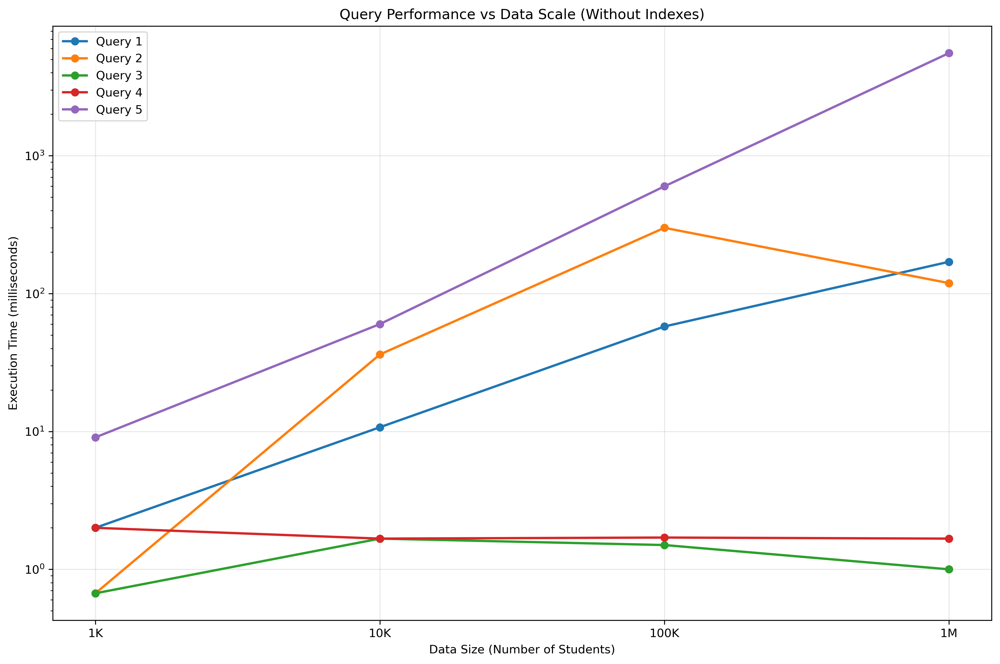

# 📊 University Database Performance Analysis

[](https://www.python.org/downloads/)
[](https://www.postgresql.org/)
[](LICENSE)
[](CONTRIBUTING.md)

A comprehensive analysis tool that demonstrates the impact of data scale and database indexing on query performance using PostgreSQL. This project generates realistic university data at different scales and measures query execution times to provide insights into database optimization strategies.



## 🎯 Overview

This project demonstrates how database performance is affected by:

1. **📈 Data Volume**: Testing queries across different scales (1K, 10K, 100K, 1M students)
2. **🔍 Database Indexing**: Comparing performance with and without strategic indexes
3. **🧮 Query Complexity**: Analyzing how different query types scale with data volume

## ✨ Key Features

- **Realistic Data Generation**: Creates university data with proper relationships using Faker
- **Multi-Scale Testing**: Tests performance across 4 different data scales
- **Comprehensive Query Analysis**: 5 different query types from simple to complex
- **Index Impact Measurement**: Before/after comparison of indexing strategies
- **Visual Analytics**: Automatic generation of performance graphs
- **Detailed Reporting**: Comprehensive markdown reports with insights

## 📋 Prerequisites

Before running this analysis, ensure you have:

- 🐘 **PostgreSQL** (version 13 or higher) installed and running
- 🐍 **Python** 3.7 or higher
- 💾 At least **8GB RAM** (recommended for 1M student dataset)
- 💽 **2GB free disk space** for data generation and storage

## 🚀 Quick Start

### 1. Clone the Repository
```bash
git clone https://github.com/yourusername/university-db-performance.git
cd university-db-performance
```

### 2. Install Dependencies
```bash
pip install -r requirements.txt
```

### 3. Configure Database
```bash
python setup_database.py
```
This script will:
- ✅ Create the `uni` database
- ✅ Generate database configuration file
- ✅ Test database connectivity

### 4. Run Performance Analysis
```bash
python university_db_performance.py
```

> ⏱️ **Note**: Full analysis with 1M students can take 30-60 minutes depending on your hardware.

## 🏗️ Database Architecture

### Schema Design
The system creates 5 interconnected tables representing a realistic university structure:

| Table | Records | Description |
|-------|---------|-------------|
| **departments** | 10 | Academic departments (CS, Math, Physics, etc.) |
| **teachers** | 100 | Faculty members distributed across departments |
| **courses** | 200 | Courses with teacher assignments |
| **students** | 1K-1M | Students with realistic enrollment data |
| **enrollments** | 5K-10M | Junction table linking students to courses |

### Query Test Suite
The analysis runs 5 distinct query types to test different performance aspects:

| Query | Type | Description | Performance Focus |
|-------|------|-------------|-------------------|
| **Q1** | Simple Filter | `SELECT * FROM students WHERE enrollment_date > ?` | Table scan performance |
| **Q2** | Multi-table Join | Join students, enrollments, courses, teachers | Join optimization |
| **Q3** | Text Search | `LIKE` pattern matching on course names | String matching performance |
| **Q4** | Aggregation | `GROUP BY` with counting operations | Aggregation performance |
| **Q5** | Complex Query | Multi-join with aggregation, filtering, and sorting | Overall system performance |

### Indexing Strategy
Strategic indexes are created to optimize common query patterns:

```sql
-- Student table optimization
CREATE INDEX idx_students_enrollment_date ON students(enrollment_date);

-- Enrollment table optimization (most critical)
CREATE INDEX idx_enrollments_student_id ON enrollments(student_id);
CREATE INDEX idx_enrollments_course_id ON enrollments(course_id);
CREATE INDEX idx_enrollments_semester ON enrollments(semester);

-- Course and teacher optimization
CREATE INDEX idx_courses_teacher_id ON courses(teacher_id);
CREATE INDEX idx_courses_course_name ON courses(course_name);
CREATE INDEX idx_teachers_department_id ON teachers(department_id);
```

## 📊 Generated Reports & Visualizations

The analysis automatically generates comprehensive documentation:

### 📈 Performance Graphs
| File | Description |
|------|-------------|
| `query_performance_vs_scale.png` | Shows query execution time vs. data volume |
| `indexing_impact.png` | Compares performance with/without indexes |

### 📝 Detailed Report
**`Lab_Report.md`** includes:
- ✅ Complete SQL schema definitions
- ✅ Performance timing tables
- ✅ Statistical analysis and insights
- ✅ Optimization recommendations
- ✅ Query improvement strategies

### Sample Results
Based on typical runs, you can expect:

| Data Scale | Query 1 | Query 2 | Query 3 | Query 4 | Query 5 |
|------------|---------|---------|---------|---------|----------|
| 1K students | ~2ms | ~1ms | ~1ms | ~2ms | ~9ms |
| 10K students | ~11ms | ~36ms | ~2ms | ~2ms | ~60ms |
| 100K students | ~58ms | ~300ms | ~2ms | ~2ms | ~600ms |
| 1M students | ~170ms | ~119ms | ~1ms | ~2ms | ~5554ms |

> 📊 **Key Finding**: Query 5 shows 61,000% performance degradation from 1K to 1M records!

## 🛠️ Troubleshooting

<details>
<summary><strong>🔌 Database Connection Issues</strong></summary>

- Ensure PostgreSQL service is running
- Verify credentials in `db_config.py`
- Check if `uni` database exists: `psql -l`
- Test connection: `psql -h localhost -U postgres -d uni`
</details>

<details>
<summary><strong>💾 Memory Issues with Large Datasets</strong></summary>

- **Minimum Requirements**: 8GB RAM for 1M student dataset
- **Alternative**: Modify scales in script for smaller datasets
- **Optimization**: Close other applications during analysis
- **Monitoring**: Watch memory usage during data generation
</details>

<details>
<summary><strong>⏱️ Performance Issues</strong></summary>

- **Data Generation**: 1M students can take 20-45 minutes
- **Overnight Runs**: Recommended for complete analysis
- **Partial Testing**: Start with smaller scales (1K, 10K)
- **Hardware**: SSD drives significantly improve performance
</details>

<details>
<summary><strong>🐍 Python Environment Issues</strong></summary>

```bash
# Create virtual environment (recommended)
python -m venv venv
source venv/bin/activate  # Linux/Mac
# or
venv\Scripts\activate     # Windows

# Install dependencies
pip install --upgrade pip
pip install -r requirements.txt
```
</details>

## ⚙️ Configuration & Customization

### Data Scale Modification
Edit `university_db_performance.py` to customize data volumes:

```python
# Modify these values in the main() function
scales = [1000, 10000, 50000, 250000]  # Custom scales
```

### Query Customization
Add your own queries in the `run_performance_tests()` method:

```python
def run_performance_tests(self, scale, with_indexes=False):
    # Add custom queries here
    custom_query = "SELECT COUNT(*) FROM students WHERE ..."
    self.time_query(custom_query, "Custom Query Description")
```

### Visualization Customization
Modify graph styling in the `create_visualizations()` method:

```python
plt.style.use('seaborn')  # Change plot style
plt.figure(figsize=(12, 8))  # Adjust figure size
```

## 🎓 Learning Objectives

By completing this project, you will gain hands-on experience with:

### Database Performance Concepts
- 📊 **Scalability Analysis**: Understanding how query performance degrades with data volume
- 🔍 **Index Optimization**: Learning when and how to create effective database indexes
- ⚡ **Query Optimization**: Identifying performance bottlenecks in complex queries
- 📈 **Performance Monitoring**: Measuring and analyzing database performance metrics

### Technical Skills
- 🐍 **Python Programming**: Working with database connections, data generation, and visualization
- 🐘 **PostgreSQL Administration**: Database setup, table creation, and index management
- 📊 **Data Visualization**: Creating meaningful charts and graphs from performance data
- 📝 **Technical Documentation**: Writing comprehensive analysis reports

### Real-World Applications
- 🏢 **Enterprise Database Design**: Understanding performance considerations for large-scale systems
- 🔧 **Database Tuning**: Practical experience with performance optimization techniques
- 📋 **Capacity Planning**: Learning to predict and plan for database growth
- 🔍 **Performance Analysis**: Developing skills to diagnose and solve performance issues

## 🤝 Contributing

We welcome contributions! Here's how you can help:

### 🐛 Bug Reports
- Use the [Issues](https://github.com/yourusername/university-db-performance/issues) tab
- Include your system information and error messages
- Provide steps to reproduce the issue

### 💡 Feature Requests
- Suggest new query types to test
- Propose additional visualization options
- Recommend new database optimization strategies

### 🔧 Pull Requests
1. Fork the repository
2. Create a feature branch: `git checkout -b feature-name`
3. Make your changes and test thoroughly
4. Commit with descriptive messages
5. Submit a pull request with detailed description

### 📋 Development Setup
```bash
# Clone your fork
git clone https://github.com/yourusername/university-db-performance.git

# Install development dependencies
pip install -r requirements.txt
pip install pytest black flake8  # Development tools

# Run tests
pytest tests/

# Format code
black .
```

## 📄 License

This project is licensed under the MIT License - see the [LICENSE](LICENSE) file for details.

## 🙏 Acknowledgments

- **PostgreSQL Community** for excellent documentation and performance insights
- **Faker Library** for realistic data generation capabilities
- **Matplotlib/Seaborn** for powerful visualization tools
- **Academic Research** on database performance optimization

## 📚 References & Further Reading

- [PostgreSQL Performance Tips](https://wiki.postgresql.org/wiki/Performance_Optimization)
- [Database Indexing Strategies](https://use-the-index-luke.com/)
- [SQL Query Optimization](https://sqlperformance.com/)
- [Python Database Programming](https://realpython.com/python-sql-libraries/)

---

⭐ **If this project helped you understand database performance, please give it a star!**

📧 **Questions?** Open an [issue](https://github.com/yourusername/university-db-performance/issues) or reach out!

## 📁 Project Structure

```
university-db-performance/
├── 📊 query_performance_vs_scale.png    # Performance visualization
├── 📈 indexing_impact.png               # Index impact analysis
├── 📝 Lab_Report.md                     # Comprehensive analysis report
├── 🐍 university_db_performance.py      # Main analysis script
├── ⚙️ setup_database.py                 # Database setup utility
├── 🗄️ database_schema.sql              # SQL schema definitions
├── 📋 requirements.txt                  # Python dependencies
├── 🔧 db_config.py                      # Database configuration (auto-generated)
├── 📖 README.md                         # Project documentation
└── 📄 Big Data Lab(Data Scale and Indexing).pdf  # Lab instructions
```

### Core Files Description

| File | Purpose | Auto-Generated |
|------|---------|----------------|
| `university_db_performance.py` | Main analysis engine | ❌ |
| `setup_database.py` | Database initialization | ❌ |
| `database_schema.sql` | Table definitions | ❌ |
| `requirements.txt` | Python dependencies | ❌ |
| `db_config.py` | Database credentials | ✅ |
| `Lab_Report.md` | Performance analysis report | ✅ |
| `*.png` | Performance visualizations | ✅ |
